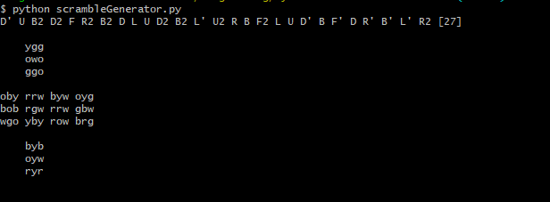

This is a random move Rubik's Cube scrambler made in python

Note: This program uses OpenCV to generate the image. You can comment out lines 348 to 468 in scrambleImage.py and 41 to 46 in scrambleGenerator.py as well as uncomment 334 to 345 in the scrambleImage.py and uncomment 36 and 37 in scrambleGenerator.py to make it work without OpenCV. It will result in something like:

